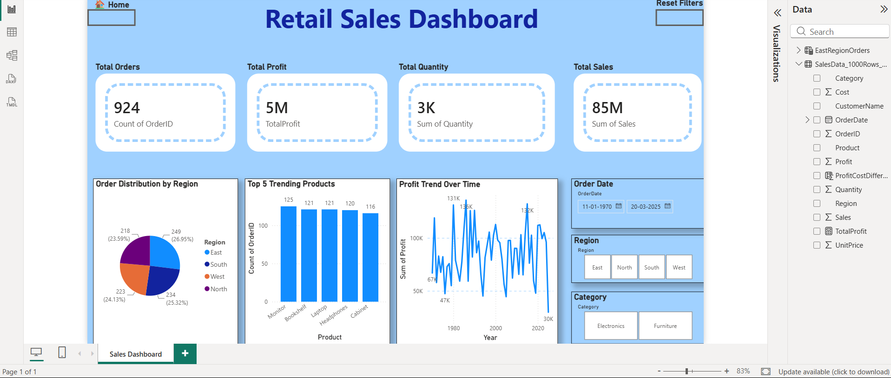

# Power BI Intermediate Assignment

## 📊 Project Overview

This project is an Intermediate Power BI Assignment focused on analyzing sales data and creating an interactive dashboard.

The project demonstrates data analysis, data visualization, KPI reporting, and interactive filtering using Microsoft Power BI.

## 🎯 Objectives

- Analyze sales performance using Power BI
- Create meaningful KPIs and business insights
- Visualize sales data using interactive charts
- Analyze sales trends and category performance
- Build an easy-to-understand interactive dashboard

## 🛠️ Tools & Technologies

- Microsoft Power BI
- Power Query
- DAX
- Data Visualization
- Data Modeling

## 📈 Dashboard Features

The Power BI dashboard includes:

- Total Sales analysis
- Sales performance analysis
- Category-wise analysis
- Interactive charts and visualizations
- Filters and slicers
- KPI cards
- Interactive dashboard navigation

## 📷 Dashboard Preview

## 📁 Project Files

| File | Description |
|------|-------------|
| `IntermediateAssignment.pbix` | Power BI project file |
| `Screenshots/Dashboard.png.png` | Dashboard screenshot |
| `README.md` | Project documentation |

## 💡 Key Learning Outcomes

Through this assignment, I gained practical experience in:

- Creating interactive Power BI dashboards
- Using DAX for data analysis
- Designing KPI cards and charts
- Applying filters and slicers
- Presenting data-driven insights
- Building professional data visualizations

## 🚀 Conclusion

This project demonstrates the use of Power BI to transform sales data into meaningful visual insights and an interactive business dashboard.

---

**Power BI Intermediate Assignment**
